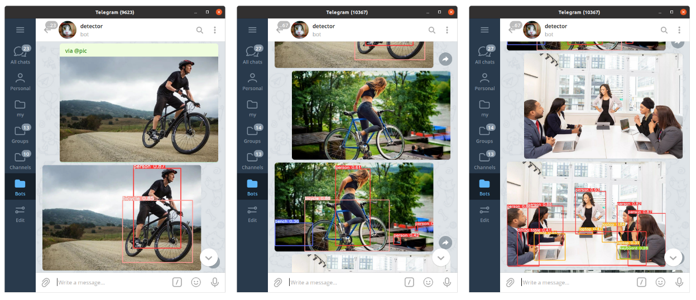

### DLS1_DETECTION [:link:](https://stepik.org/course/101721/syllabus)

* model: [YOLOv5](https://github.com/ultralytics/yolov5) pretrained on [MS COCO](https://cocodataset.org/#home)
* deployment: vm instance on [oracle cloud](https://www.oracle.com/cloud)
* demo: https://t.me/vaaliferov_detector_bot

```bash
python3 -m venv env
source env/bin/activate
apt install -y libfreetype6-dev
pip install -r requirements.txt
gdown 17yHgtpMOjaboKukLcZeoCN1hNRU6B-kz
python3 bot.py <bot_owner_id> <bot_token>
```

